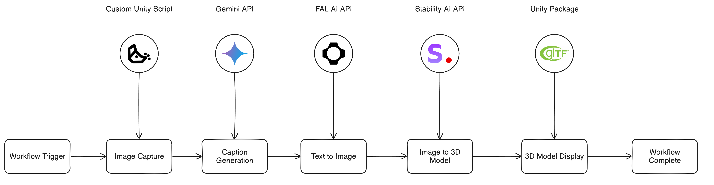

Below is a detailed README in Markdown format that you can use for your GitHub repository:

-----------------------------------------------------------
# Mind Palace XR

Mind Palace XR is an innovative Unity-based application that transforms your real-world surroundings into interactive 3D memory aids. Here's how it works:

1. The app captures what you're looking at through your device's camera
2. Using Google's Gemini AI, it generates a detailed description of the captured scene via its API.
3. This description is then transformed into a stylized 2D image using FalAI's image generation API.
4. The 2D image is converted into a detailed 3D model using StabilityAI's Text to 3D Model API.
5. Finally, the 3D model is displayed in your virtual environment using GLTFast Package.

This technology serves as a powerful memory enhancement tool, allowing users to create personalized "memory palaces" at world scale - virtual spaces filled with 3D representations of things they want to remember. By associating information with these interactive 3D models, users can utilise spatial memory techniques for better information recall.

## Table of Contents

- [Overview](#overview)
- [Features](#features)
- [Workflow](#workflow)
- [Future Improvements](#future-improvements)
- [Development Tools](#development-tools)
- [License](#license)

## Overview

Mind Palace XR leverages cutting-edge AI technologies to create an immersive memory enhancement experience:

1. *Real-World Capture:* Uses your device's camera to capture your surroundings in real-time.
2. *AI Scene Understanding:* Employs Google's Gemini API for advanced scene analysis and description generation.
3. *Artistic Interpretation (limited agency):* Utilizes FalAI to transform textual descriptions into visually striking 2D representations.
4. *3D Transformation:* Converts 2D imagery into detailed 3D models via StabilityAI's advanced 3D generation technology.
5. *Spatial Integration:* Places these 3D memory aids in your virtual space using Unity's GLTFast rendering system.

The entire pipeline operates seamlessly in real-time, allowing users to create and populate their personal memory spaces naturally and intuitively.

## Features

- *Advanced Camera Integration:* Real-time capture of your environment using Unity's camera system.
- *AI-Powered Scene Analysis:* Sophisticated scene understanding using Google's Gemini Vision API.
- *Dynamic 2D Visualization:* High-quality image generation through FalAI's advanced image synthesis API.
- *Automated 3D Model Creation:* Cutting-edge 3D model generation using StabilityAI's specialized 3D conversion API.
- *Spatial Memory Enhancement:* Strategic placement of 3D models in your virtual space for optimal memory retention.
- *Persistent Memory Palace:* Local storage of generated 3D models with automatic organization and timestamping.
- *Intuitive Controls:* Simple UI controls for capturing, generating, and placing memory objects.

## Workflow

The Mind Palace XR workflow is designed to be intuitive and efficient:

1. *Initiating a Memory Capture*
   - Point your device at the object or scene you want to remember
   - Trigger the capture using the UI button or gesture control
   
2. *Scene Analysis & Description*
   - The captured image is processed through Gemini Vision API
   - AI generates a detailed, context-aware description of the scene
   - The description appears on-screen for user verification

3. *Visual Synthesis*
   - The AI-generated description is sent to FalAI
   - FalAI creates a stylized 2D representation
   - Progress is tracked with real-time status updates

4. *3D Model Generation*
   - The 2D image is processed by StabilityAI's 3D generation system
   - A detailed 3D model is created and optimized for VR/AR viewing
   - The model is automatically saved to your local memory palace collection

5. *Spatial Placement*
   - The 3D model appears in your virtual space
   - Position and scale are automatically optimized for viewing
   - Users can adjust placement for optimal memory association

6. *Quality Assurance*
   - Each step includes comprehensive error checking
   - Failed generations are gracefully handled with user feedback
   - The system maintains model quality and performance standards

## Future Improvements

- *Realtime Conversational AI:* Adding an intelligent AI assistant to handle all operations, serve as a natural interface with users, and manage triggers while making the experience more human-centric
- *VR capabilities:* Adding VR capabilities to the application to allow users to view the memory palace in a more immersive way
- *Advanced Spatial Analysis:* Better understanding of real-world space for model placement with ambient occlusion
- *Improved Model Generation:* Higher fidelity 3D models with better detail preservation
- *Cross-Platform Support:* Expanded device compatibility including Andorid XR
- *Performance Optimization:* Faster processing and reduced memory footprint

## Development Tools

This project's codebase was developed with assistance from:
- OpenAI O3 reasoning Model capabilities for core logic implementation and optimization
- Anthropic's Claude 3 Sonnet for code refinement and error resolution

## License

This project is licensed under the MIT License. 